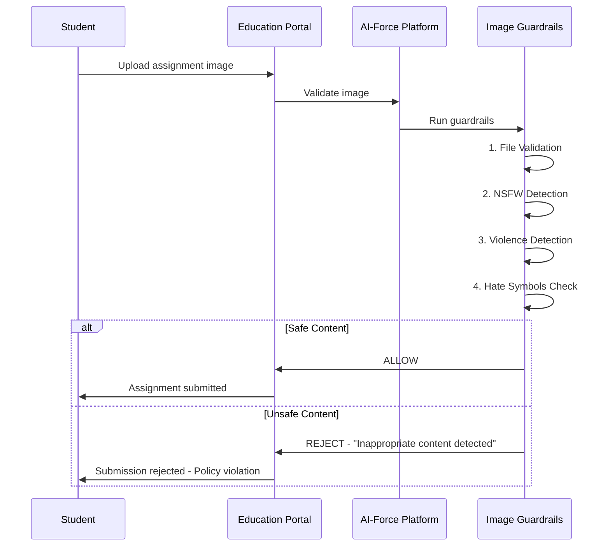
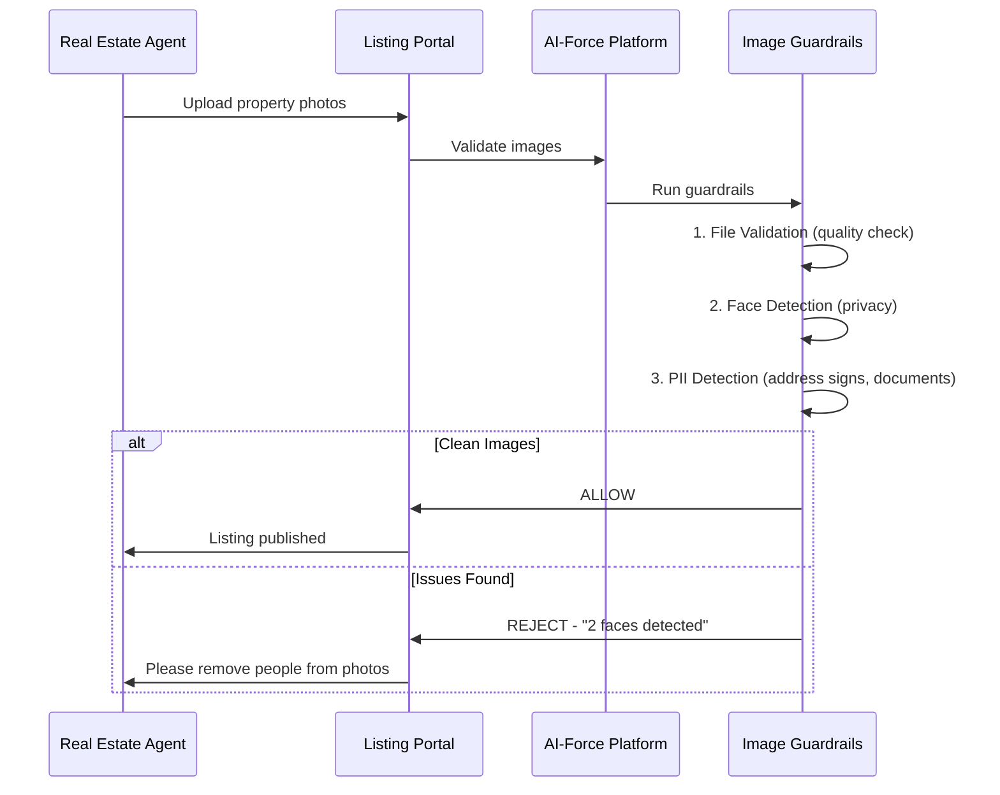
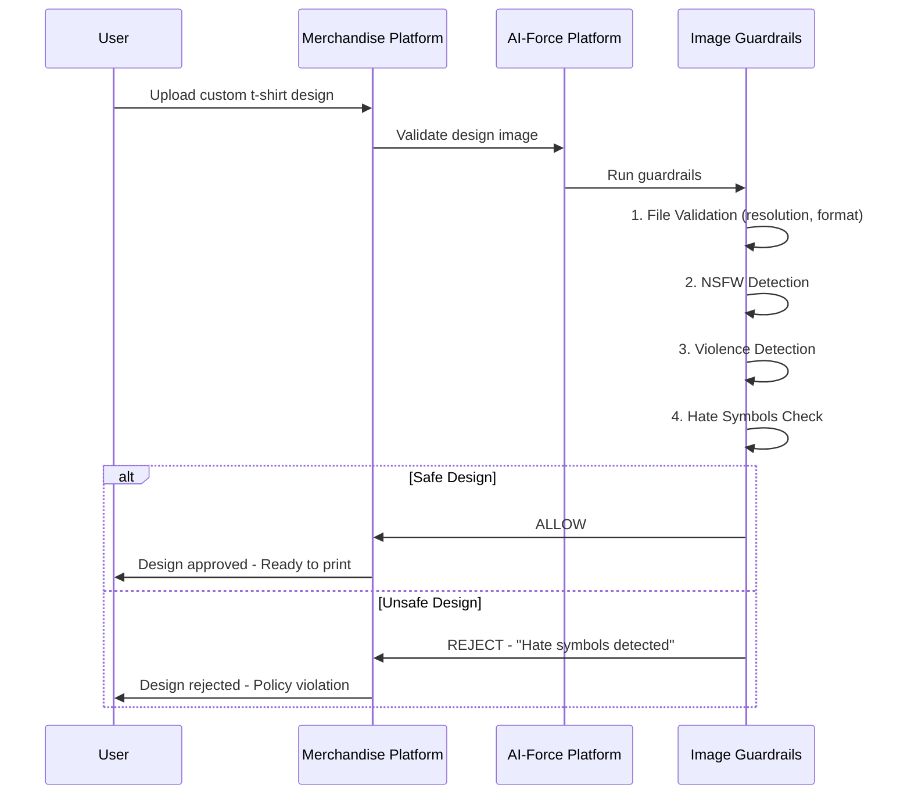
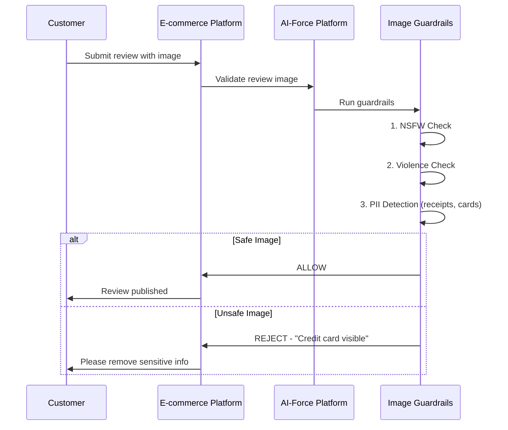
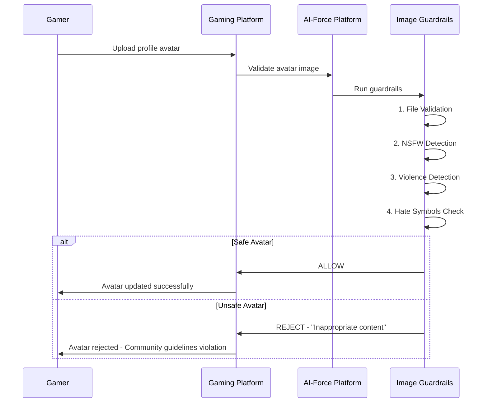

# AI-Force Image Guardrails - Demo Use Cases

## Overview

Enterprise use cases demonstrating Image Guardrails on the AI-Force Platform.

---

## Use Case 1: Education Platform - Student Assignment Submission

### Client Profile
- **Industry:** EdTech / Online Learning
- **Challenge:** Validate student-uploaded assignment images for inappropriate content

### Business Scenario
An online education platform allows students to upload handwritten assignments, diagrams, or project photos. Content must be validated before submission to instructors.

### Flow

### Guardrails Applied

| Check | Detects | Action |
|-------|---------|--------|
| File Validation | Valid image format | REJECT if invalid |
| NSFW | Inappropriate images | REJECT |
| Violence | Violent imagery | REJECT |
| Hate Symbols | Offensive symbols | REJECT |

### Demo Scenario
1. Upload math assignment photo → **ALLOW**
2. Upload image with inappropriate drawing → **REJECT** - "NSFW score: 0.85"
3. Upload image with hate symbol → **REJECT** - "Hate symbols detected"

### Business Value
- Safe learning environment
- Protect instructors from inappropriate content
- Automated policy enforcement at scale

---

## Use Case 2: Real Estate Platform - Property Listing Validation

### Client Profile
- **Industry:** Real Estate / PropTech
- **Challenge:** Ensure property listing images are professional and compliant

### Business Scenario
A real estate marketplace validates property images uploaded by agents before listing goes live.

### Flow

### Guardrails Applied

| Check | Detects | Reason |
|-------|---------|--------|
| Faces | People in photos | Privacy - tenants/owners visible |
| PII (OCR) | Address, documents | Sensitive info visible |
| File Validation | Low quality images | Professional standards |

### Demo Scenario
1. Upload empty room photo → **ALLOW**
2. Upload room with family visible → **REJECT** - "3 faces detected"
3. Upload image showing mail with address → **REJECT** - "PII detected: ADDRESS"

### Business Value
- Protect tenant/owner privacy
- Ensure professional listing quality
- Avoid legal issues with exposed PII

---

## Use Case 3: Custom Merchandise Platform - Design Uploads

### Client Profile
- **Industry:** Print-on-Demand / Custom Merchandise
- **Challenge:** Validate user-uploaded designs for t-shirts, mugs, posters before printing

### Business Scenario
A custom merchandise platform allows users to upload designs for printing on products. Designs must be screened for inappropriate content before production.

### Flow

### Guardrails Applied

| Check | Detects | Action |
|-------|---------|--------|
| NSFW | Adult/explicit imagery | REJECT |
| Violence | Weapons, gore | REJECT |
| Hate Symbols | Nazi, extremist symbols | REJECT |
| File Validation | Print quality requirements | REJECT if low quality |

### Demo Scenario
1. Upload artistic design → **ALLOW** → Proceed to print
2. Upload design with swastika → **REJECT** - "Hate symbols detected"
3. Upload design with weapon imagery → **REJECT** - "Violence: guns=0.91"

### Business Value
- Prevent printing offensive merchandise
- Protect brand reputation
- Avoid legal liability
- Automated screening at scale

---

## Use Case 4: E-commerce - Product Review Images

### Client Profile
- **Industry:** E-commerce / Marketplace
- **Challenge:** Moderate user-submitted product review images

### Business Scenario
An e-commerce platform allows customers to upload images with their product reviews. These need moderation.

### Flow

### Guardrails Applied

| Check | Detects | Reason |
|-------|---------|--------|
| NSFW | Inappropriate images | Community standards |
| PII (OCR) | Credit cards, receipts | Customer data protection |
| Violence | Damaged/unsafe products | Platform safety |

### Demo Scenario
1. Upload product photo → **ALLOW**
2. Upload receipt with credit card visible → **REJECT** - "Credit card detected"
3. Upload inappropriate image → **REJECT** - "NSFW score: 0.91"

### Business Value
- Protect customer PII
- Maintain platform reputation
- Automated moderation at scale

---

## Use Case 5: Gaming Platform - User Avatar Uploads

### Client Profile
- **Industry:** Gaming / Entertainment
- **Challenge:** Moderate user-uploaded profile avatars and in-game images

### Business Scenario
A gaming platform allows users to upload custom profile avatars and share screenshots. All uploads must be screened for inappropriate content to maintain community standards.

### Flow

### Guardrails Applied

| Check | Detects | Action |
|-------|---------|--------|
| NSFW | Explicit/adult imagery | REJECT |
| Violence | Gore, weapons, blood | REJECT |
| Hate Symbols | Extremist symbols | REJECT |
| File Validation | Valid image format | REJECT if invalid |

### Demo Scenario
1. Upload gaming character avatar → **ALLOW**
2. Upload avatar with explicit content → **REJECT** - "NSFW score: 0.92"
3. Upload avatar with hate symbol → **REJECT** - "Hate symbols detected"

### Business Value
- Safe gaming environment for all ages
- Protect community from toxic content
- Automated moderation at scale
- Maintain platform reputation

---

## Summary

| Use Case | Industry | Key Guardrails | Primary Value |
|----------|----------|----------------|---------------|
| Assignment Submission | Education | NSFW, Violence, Hate | Safe learning environment |
| Property Listings | Real Estate | Faces, PII | Privacy protection |
| Design Uploads | Custom Merchandise | NSFW, Violence, Hate | Brand protection |
| Review Images | E-commerce | NSFW, PII | Customer protection |
| Avatar Uploads | Gaming | NSFW, Violence, Hate | Community safety |

### Platform Capabilities Demonstrated

| Capability | Description |
|------------|-------------|
| **Early Exit** | Stops on first failed check - efficient processing |
| **Explainability** | Clear rejection reasons for users |
| **PII via API** | External /scan/prompt for sensitive data |
| **Configurable** | Thresholds adjustable per use case |
| **Compliance Ready** | GDPR, HIPAA, PCI-DSS support |
