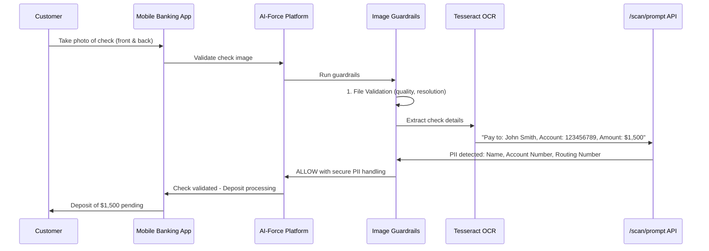
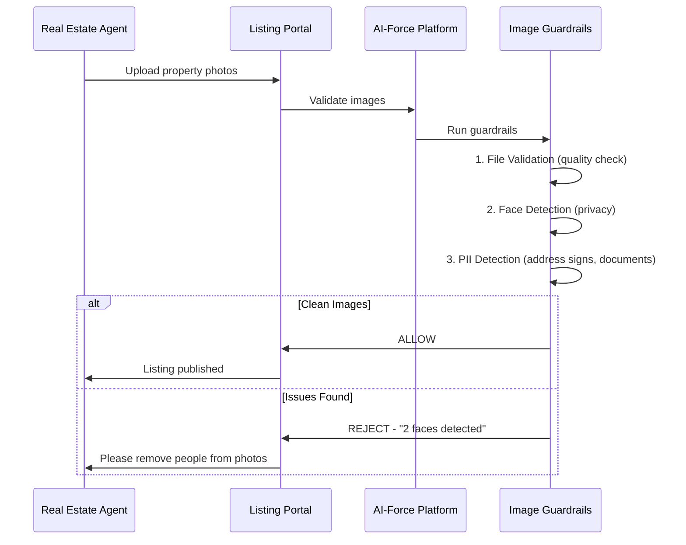
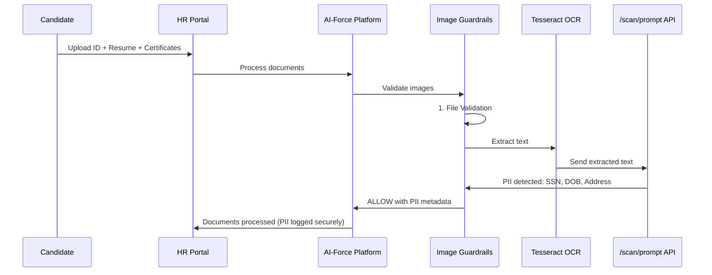
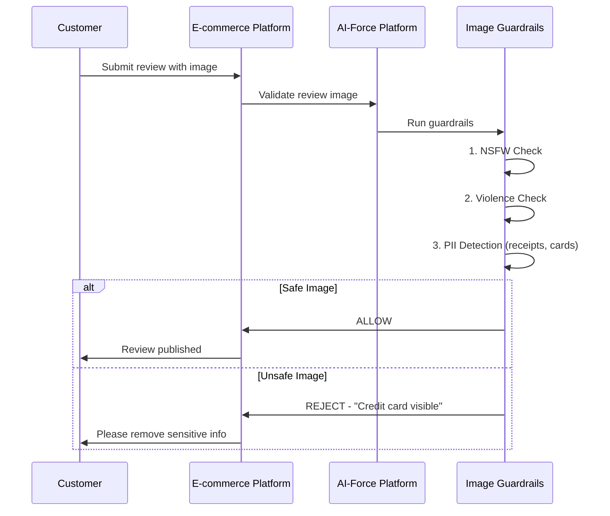
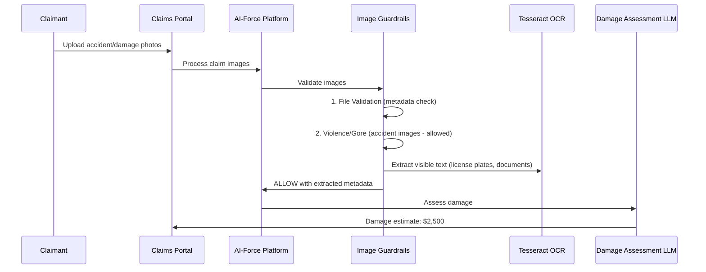

# AI-Force Image Guardrails - Demo Use Cases

## Overview

Enterprise use cases demonstrating Image Guardrails on the AI-Force Platform.

---

## Use Case 1: Banking - Mobile Check Deposit

### Client Profile
- **Industry:** Banking / FinTech
- **Challenge:** Validate check images for mobile deposit while detecting fraud and PII

### Business Scenario
A bank's mobile app allows customers to deposit checks by taking photos. Images must be validated for quality and sensitive data must be handled securely.

### Flow

### Guardrails Applied

| Check | Detects | Compliance |
|-------|---------|------------|
| File Validation | Image quality, blur detection | Deposit accuracy |
| PII Detection | Account numbers, routing numbers | PCI-DSS |
| OCR Extraction | Check amount, payee, date | Fraud prevention |

### Demo Scenario
1. Upload clear check image → PII extracted securely → **ALLOW**
2. Upload blurry check → **REJECT** - "Image quality insufficient"
3. Upload check with mismatched amounts → **FLAG** for review

### Business Value
- Secure mobile deposit processing
- PCI-DSS compliance automated
- Fraud detection via validation

---

## Use Case 2: Real Estate Platform - Property Listing Validation

### Client Profile
- **Industry:** Real Estate / PropTech
- **Challenge:** Ensure property listing images are professional and compliant

### Business Scenario
A real estate marketplace validates property images uploaded by agents before listing goes live.

### Flow

### Guardrails Applied

| Check | Detects | Reason |
|-------|---------|--------|
| Faces | People in photos | Privacy - tenants/owners visible |
| PII (OCR) | Address, documents | Sensitive info visible |
| File Validation | Low quality images | Professional standards |

### Demo Scenario
1. Upload empty room photo → **ALLOW**
2. Upload room with family visible → **REJECT** - "3 faces detected"
3. Upload image showing mail with address → **REJECT** - "PII detected: ADDRESS"

### Business Value
- Protect tenant/owner privacy
- Ensure professional listing quality
- Avoid legal issues with exposed PII

---

## Use Case 3: HR Platform - Resume & Document Processing

### Client Profile
- **Industry:** HR Tech / Recruitment
- **Challenge:** Process candidate documents while ensuring compliance

### Business Scenario
An HR platform processes resumes, ID documents, and certificates uploaded by job applicants.

### Flow

### Guardrails Applied

| Check | Detects | Compliance |
|-------|---------|------------|
| PII Detection | SSN, DOB, Address, Phone | GDPR, CCPA |
| Face Detection | Photo on ID/Resume | Bias prevention |
| File Validation | Valid document formats | - |

### Demo Scenario
1. Upload resume PDF as image → OCR extracts text → PII detected → **ALLOW** (logged)
2. Upload ID card → Face detected, PII extracted → **ALLOW** (secure handling)

### Business Value
- GDPR/CCPA compliance
- Reduce bias in hiring (face detection awareness)
- Secure PII handling with audit trail

---

## Use Case 4: E-commerce - Product Review Images

### Client Profile
- **Industry:** E-commerce / Marketplace
- **Challenge:** Moderate user-submitted product review images

### Business Scenario
An e-commerce platform allows customers to upload images with their product reviews. These need moderation.

### Flow

### Guardrails Applied

| Check | Detects | Reason |
|-------|---------|--------|
| NSFW | Inappropriate images | Community standards |
| PII (OCR) | Credit cards, receipts | Customer data protection |
| Violence | Damaged/unsafe products | Platform safety |

### Demo Scenario
1. Upload product photo → **ALLOW**
2. Upload receipt with credit card visible → **REJECT** - "Credit card detected"
3. Upload inappropriate image → **REJECT** - "NSFW score: 0.91"

### Business Value
- Protect customer PII
- Maintain platform reputation
- Automated moderation at scale

---

## Use Case 5: Insurance - Claims Processing

### Client Profile
- **Industry:** Insurance
- **Challenge:** Process claim images (accidents, damage) while detecting fraud

### Business Scenario
An insurance company processes claim images submitted by policyholders.

### Flow

### Guardrails Applied

| Check | Detects | Action |
|-------|---------|--------|
| File Validation | Image metadata, timestamps | Fraud detection |
| PII (OCR) | License plates, policy numbers | Secure logging |
| Violence | Accident imagery | ALLOW (expected for claims) |

### Demo Scenario
1. Upload car damage photo → **ALLOW** → Damage assessed
2. Upload photo with license plate → PII detected, logged securely → **ALLOW**
3. Upload manipulated image → Metadata mismatch → **FLAG for review**

### Business Value
- Faster claims processing
- Fraud detection via metadata
- Secure PII handling

---

## Summary

| Use Case | Industry | Key Guardrails | Primary Value |
|----------|----------|----------------|---------------|
| Mobile Check Deposit | Banking | PII, File Validation | PCI-DSS Compliance |
| Property Listings | Real Estate | Faces, PII | Privacy protection |
| Document Processing | HR/Recruitment | PII, Faces | Compliance (GDPR) |
| Review Images | E-commerce | NSFW, PII | Customer protection |
| Claims Processing | Insurance | File Validation, PII | Fraud detection |

### Platform Capabilities Demonstrated

| Capability | Description |
|------------|-------------|
| **Early Exit** | Stops on first failed check - efficient processing |
| **Explainability** | Clear rejection reasons for users |
| **PII via API** | External /scan/prompt for sensitive data |
| **Configurable** | Thresholds adjustable per use case |
| **Compliance Ready** | GDPR, HIPAA, PCI-DSS support |
